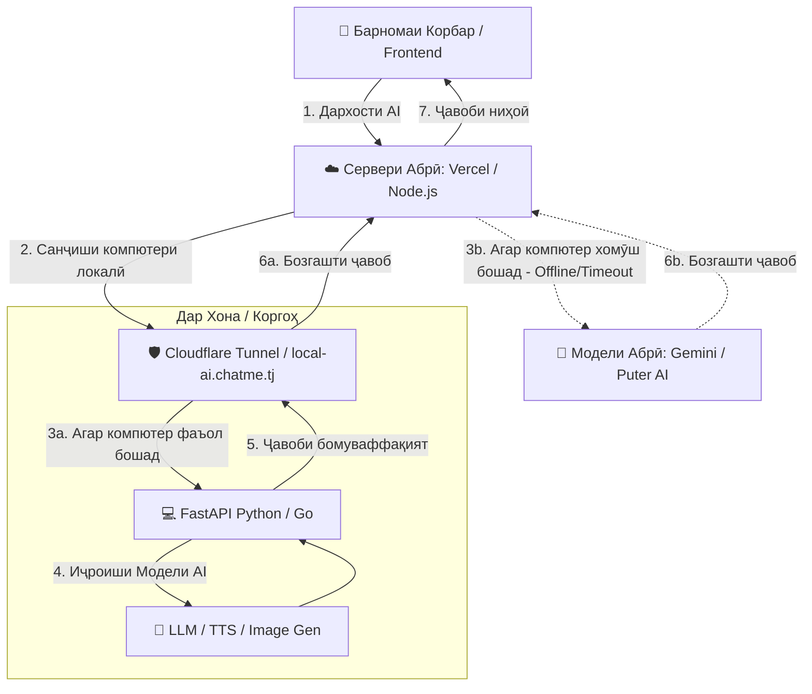

# Архитектураи Бекенди Гибридӣ барои Моделҳои Ҳуши Маснуӣ (Cloud-Local AI Hybrid)

Ин ҳуҷҷат роҳнамои пурра ва қадам ба қадам барои сохтани як **Бекенди Гибридӣ (Hybrid Backend)** мебошад. Ин система имкон медиҳад, ки вақте компютери шахсии шумо фаъол аст, тамоми амалиётҳои вазнин ва моделҳои Ҳуши Маснуӣ (AI) дар компютери худатон иҷро шаванд (барои сарфаи маблағ ва истифодаи тамоми қувваи кории компютер). Вақте ки компютери шумо хомӯш аст, бекенди абрӣ (Cloud Backend) ба таври худкор вазифаҳоро ба дӯш мегирад (Fallback).

---

## 📊 Нақшаи Корӣ ва Архитектура (How it Works)

Дар ин архитектура, **Сервери Абрӣ (Vercel Node.js ё PHP API)** ҳамчун дарвоза (Gateway / Proxy) кор мекунад. Вақте ки дархост аз ҷониби корбар меояд:
1. Сервери абрӣ кӯшиш мекунад, ки бо бекенди локалии компютери шумо (Python FastAPI ё Go) тавассути туннели бехатар пайваст шавад.
2. Агар компютери шумо фаъол бошад, амалиёт дар онҷо иҷро шуда, ҷавоб ба сервери абрӣ ва аз онҷо ба корбар бармегардад.
3. Агар компютери шумо хомӯш бошад (Connection Timeout ё хатогии 502/503), сервери абрӣ ба таври худкор ба моделҳои абрӣ (масалан, Gemini API, OpenAI ё Puter AI) мегузарад ва корбар ҳеҷ гуна қатъшавиро ҳис намекунад.



---

## 🛠️ Қадами 1: Сохтани Бекенди Локалӣ (Python FastAPI ё Go)

Барои кор бо моделҳои Ҳуши Маснуӣ (AI), забони **Python** беҳтарин ва осонтарин интихоб аст, зеро тамоми китобхонаҳои AI (PyTorch, HuggingFace, Ollama, Transformers) бо забони пайтон сохта шудаанд.

Дар зер намунаи содда ва пуриқтидори бекенд бо истифодаи **FastAPI (Python)** оварда шудааст:

### Намуна дар Python (FastAPI):
Барои насб кардани китобхонаҳо:
```bash
pip install fastapi uvicorn pydantic requests
```

Сохтани файли `local_server.py`:
```python
from fastapi import FastAPI, HTTPException
from pydantic import BaseModel
import time

app = FastAPI(title="Chatme Local AI Engine")

class AIRequest(BaseModel):
    prompt: str
    user_id: int

@app.get("/health")
def health_check():
    # Ин endpoint барои санҷидани фаъол будани компютери шумо истифода мешавад
    return {"status": "online", "timestamp": time.time()}

@app.post("/api/ai/chat")
async def process_ai_chat(request: AIRequest):
    try:
        # ИНҶО МОДЕЛҲОИ ЛОКАЛИИ ХУДРО НАВИСЕД
        # Масалан: истифодаи Ollama ё ягон модели HuggingFace
        # local_response = ollama.generate(model='llama3', prompt=request.prompt)
        
        simulated_response = f"[Локалӣ - PC] Ҷавоб ба prompt: '{request.prompt}'. Ташаккур барои муроҷиат!"
        
        return {
            "success": True,
            "engine": "local_pc_python",
            "response": simulated_response
        }
    except Exception as e:
        raise HTTPException(status_code=500, detail=str(e))

if __name__ == "__main__":
    import uvicorn
    # Серверро дар порти 8000 фаъол мекунем
    uvicorn.run(app, host="0.0.0.0", port=8000)
```

---

## 🌐 Қадами 2: Пайваст кардани Компютер ба Интернет (Туннели Бехатар)

Барои он ки сервери абрии шумо (Vercel) тавонад ба компютери локалии шумо дархост фиристад, ба шумо лозим аст, ки компютери худро бехатар ба интернет кушоед. Роҳи беҳтарин, бепул ва бехатарин — **Cloudflare Tunnel** мебошад. Шумо ба кушодани портҳои роутер (Port Forwarding) ниёз надоред!

### Чӣ тавр бояд насб кард?
1. Ба сайти [Cloudflare](https://dash.cloudflare.com/) равед ва домени худро (масалан `chatme.tj`) илова кунед (агар аллакай илова нашуда бошад).
2. 🛡️ Боргирӣ кунед ва барномаи **`cloudflared`**-ро барои Windows насб кунед.
3. Сохтани туннел тавассути фармонҳо дар компютери локалӣ:
   ```bash
   # Ворид шудан ба аккаунти Cloudflare
   cloudflared tunnel login
   
   # Сохтани туннели нав бо номи 'chatme-local-ai'
   cloudflared tunnel create chatme-local-ai
   ```
4. Танзим кардани туннел барои пайваст кардани домен ба сервери локалии `http://localhost:8000`:
   ```bash
   # Пайваст кардани суруди туннел ба субдомени дилхоҳатон
   cloudflared tunnel route dns chatme-local-ai local-ai.chatme.tj
   ```
5. Оғоз кардани туннел:
   ```bash
   cloudflared tunnel run --url http://localhost:8000 chatme-local-ai
   ```
   *Шумо инчунин метавонед `cloudflared`-ро ҳамчун **Windows Service** насб кунед, то ин ки ҳангоми фурӯзон шудани компютер он худкор дар замина (background) фаъол шавад.*

---

## ☁️ Қадами 3: Навиштани Механизми Фаллбэк дар Сервери Абрӣ (Vercel `server.js`)

Ҳозир мо ба файли `server.js` дар лоиҳаи Vercel-и шумо механизми интеллектуалӣ илова мекунем. Вақте ки дархости AI меояд, сервер аввал кӯшиш мекунад, ки бо `local-ai.chatme.tj` пайваст шавад. Агар компютери шумо хомӯш бошад, он ба таври худкор ба моделҳои дигар мегузарад.

Дар зер коди намунавӣ барои `server.js` оварда шудааст:

```javascript
const fetch = require('node-fetch');

// Суроғаи туннели локалии шумо
const LOCAL_AI_URL = "https://local-ai.chatme.tj";

async function handleAIChatRequest(req, res) {
    const { prompt, userId } = req.body;
    
    // Сарлавҳаҳо барои фиристодани дархост бо timeout-и кӯтоҳ (масалан, 3 сония)
    const controller = new AbortController();
    const timeoutId = setTimeout(() => controller.abort(), 3000); 

    try {
        console.log("Кӯшиши пайвастшавӣ бо компютери локалӣ...");
        
        const localResponse = await fetch(`${LOCAL_AI_URL}/api/ai/chat`, {
            method: 'POST',
            headers: { 'Content-Type': 'application/json' },
            body: JSON.stringify({ prompt, user_id: userId }),
            signal: controller.signal
        });
        
        clearTimeout(timeoutId);

        if (localResponse.ok) {
            const data = await localResponse.json();
            console.log("Ҷавоб аз компютери локалӣ гирифта шуд!");
            return res.json(data);
        } else {
            throw new Error(`Хатогии сервери локалӣ: ${localResponse.status}`);
        }

    } catch (err) {
        clearTimeout(timeoutId);
        console.warn("⚠️ Компютери локалӣ дастрас нест (ё хомӯш аст). Гузариш ба Бекенди Абрӣ (Gemini/Puter AI)...");
        
        // ─── ФАЛЛБЭК: ИСТИФОДАИ AI ДАР АБР ──────────────────────────────────────────
        try {
            // Дар инҷо шумо метавонед аз Puter AI ё Gemini API истифода баред
            // Намуна бо истифодаи Puter.js (ки дар лоиҳаи шумо аллакай мавҷуд аст):
            // const response = await puter.ai.chat(prompt);
            
            const cloudResponse = `[Абрӣ - Fallback] Ҷавоб ба prompt: '${prompt}'. (Компютери шахсӣ ҳоло ғайрифаъол аст)`;
            
            return res.json({
                success: true,
                engine: "cloud_fallback",
                response: cloudResponse
            });
        } catch (cloudErr) {
            console.error("Хатогӣ дар сервери абрӣ низ рух дод:", cloudErr);
            return res.status(500).json({ error: "Хатогии пурраи система" });
        }
    }
}
```

---

## ✨ Афзалиятҳои ин Роҳбурд (Benefits)

1. **🚀 Сарфаи буҷет**: Шумо метавонед моделҳои хеле калон (ба монанди Llama-3 8B, Qwen-2 ё моделҳои тасвирсози Stable Diffusion)-ро дар кортҳои графикии (GPU) компютери худ комилан ройгон кор фармоед ва маблағи серверҳои абриро сарфа кунед.
2. **🔒 Амният ва Махфият**: Маълумотҳои ҳассос метавонанд танҳо дар компютери шумо коркард шаванд ва ба ширкатҳои беруна фиристода нашаванд.
3. **🔄 Устувории 100% (High Availability)**: Корбарон ҳеҷ гоҳ хатогии "Сервер хомӯш аст"-ро намебинанд, зеро система ба таври худкор дар байни ду сервер коммутатсия (switch) мекунад.

---

### 💡 Маслиҳатҳои Иловагӣ барои Натиҷаи Беҳтар:
* **Барои кор бо моделҳо дар компютери локалӣ**: Барномаи **[Ollama](https://ollama.com/)**-ро дар компютератон насб кунед. Ин барнома имкон медиҳад, ки моделҳои машҳурро ба монанди Llama 3 ё Mistral бо як фармон фаъол созед ва FastAPI-ро ба он пайваст кунед.
* **Танзими Cloudflare Tunnel ҳамчун Сервиси Windows**:
  Барои он ки барнома ҳангоми фурӯзон шудани Windows худкор оғоз шавад, дар PowerShell бо ҳуқуқҳои Administrator инро нависед:
  ```powershell
  cloudflared service install
  ```
  Ин туннелро ба як сервиси автоматии Windows табдил медиҳад ва дигар ниёзе ба кушода нигоҳ доштани равзанаи CMD/PowerShell нест.
